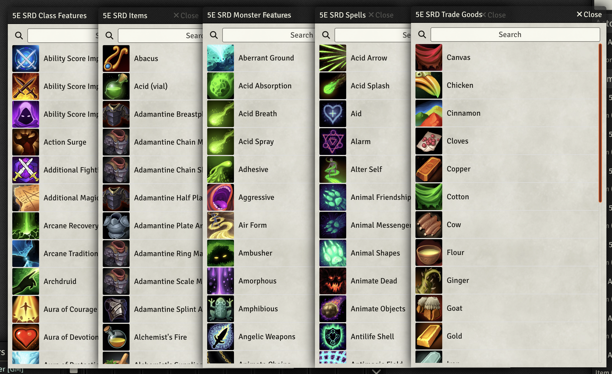

# D&D 5e SRD Content (A5e)

This module includes converted versions of the D&D 5e SRD content for the [A5e Foundry system](https://github.com/Pjb518/FoundryVTT-Level-Up-Official). Currently, the module includes the following packs, with more to come soon:

- Monsters
- Monster Features
- Class Features
- Items
- Spells
- Trade Goods

## Funding

If you'd like to support my continued work on Foundry VTT modules and the [A5e Foundry system](https://foundryvtt.com/packages/a5e), please consider visiting my Ko-Fi page: 

## Licenses

The content of this module, specifically the data located in the packs directory, is offered and may be used under the terms of the [Open Gaming License v1.0a](https://github.com/Pjb518/a5e-kobold-press-ogl/blob/main/OGL.md).

The module software is distributed under the [MIT License](https://mit-license.org/).
